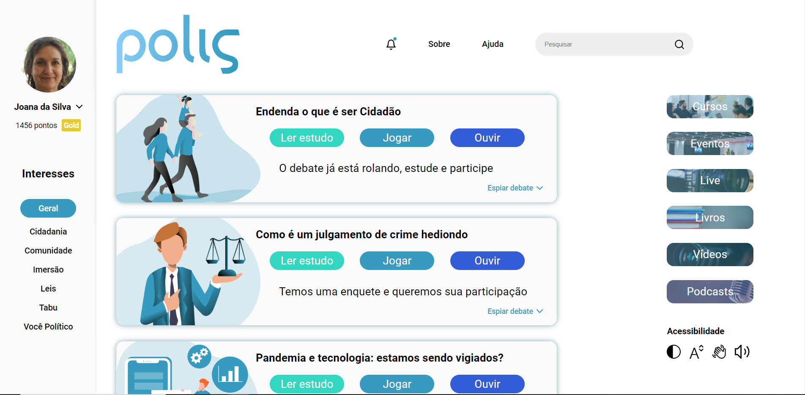

<h1 align ="center">
    </img>
</h1>

 
## Polis 🚀 em construção... 🚧

## 💻 Sobre o projeto

> O projeto Polis é uma plataforma gamificada que irá democratizar a educação política brasileira. Com a Polis, os usuários podem acessar conteúdos sobre leis, políticas, cidadania entre outros diversos assuntos com uma didática simples e com exemplos do seu dia a dia. A plataforma disponibiliza conteúdo por meio de:

- Vídeos
- Textos
- Podcasts 

## 🛠 Tecnologias

Front End

- HTML
- CSS
- JavaScript

## 💡 Curiosidades

> Como prova de conceito, a plataforma foi construída utilizando apenas as tecnologias base da web.

## 🎨 Layout
> O [layout](https://www.figma.com/file/AIMZEOqBeEXrg43owocZ4I/Polis-Prototipo) da aplicação está disponível no Figma:

## 🤖 Equipe
- [Bianca](https://github.com/bkkater)
- [Paulo](https://www.linkedin.com/in/paulodocarmo/)
- [Daniel](https://github.com/danitw)
- [Wyllamisson](https://www.linkedin.com/in/wyllamisson/)

## 📏 Mentores
- [Igor](https://www.linkedin.com/in/igor-arnaldo-de-alencar-5219b014b/)
- [Ana Maria](https://www.linkedin.com/in/ana-maria-vianna-9035b2165/)
- [Bruna]()

